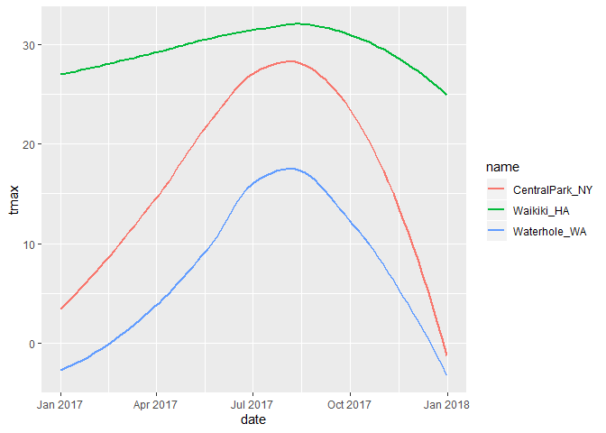
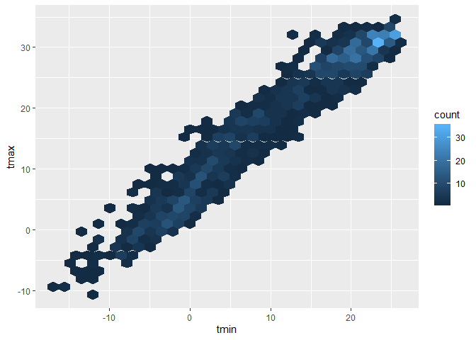
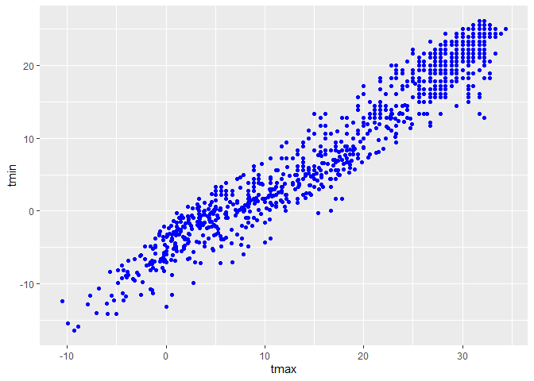
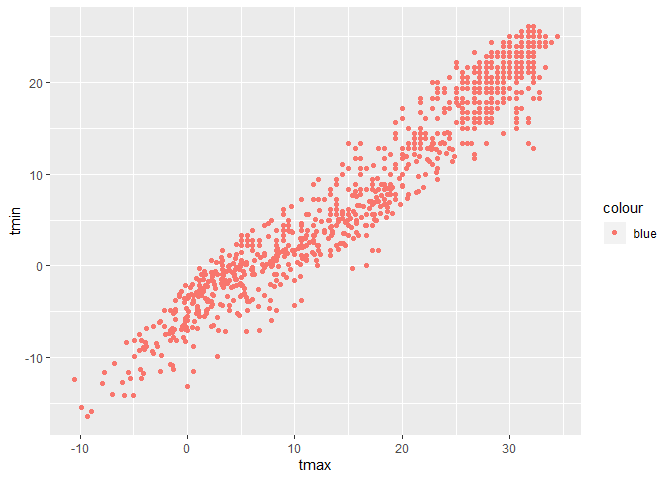
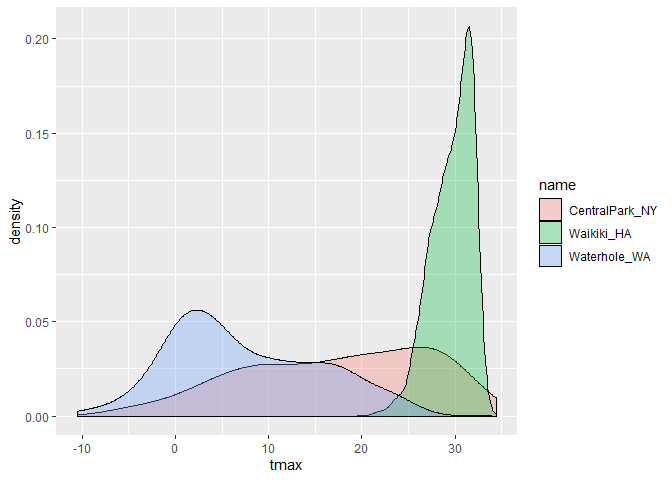

`ggplot` 1
================
Xun Wang
9/26/2019

## create the weather data

``` r
weather_df = 
  rnoaa::meteo_pull_monitors(c("USW00094728", "USC00519397", "USS0023B17S"),
                      var = c("PRCP", "TMIN", "TMAX"), 
                      date_min = "2017-01-01",
                      date_max = "2017-12-31") %>%
  mutate(
    name = recode(id, USW00094728 = "CentralPark_NY", 
                      USC00519397 = "Waikiki_HA",
                      USS0023B17S = "Waterhole_WA"),
    tmin = tmin / 10,
    tmax = tmax / 10) %>%
  select(name, id, everything())
```

    ## Registered S3 method overwritten by 'crul':
    ##   method                 from
    ##   as.character.form_file httr

    ## Registered S3 method overwritten by 'hoardr':
    ##   method           from
    ##   print.cache_info httr

    ## file path:          C:\Users\xwang\AppData\Local\rnoaa\rnoaa\Cache/ghcnd/USW00094728.dly

    ## file last updated:  2019-09-19 21:39:53

    ## file min/max dates: 1869-01-01 / 2019-09-30

    ## file path:          C:\Users\xwang\AppData\Local\rnoaa\rnoaa\Cache/ghcnd/USC00519397.dly

    ## file last updated:  2019-09-19 21:40:09

    ## file min/max dates: 1965-01-01 / 2019-09-30

    ## file path:          C:\Users\xwang\AppData\Local\rnoaa\rnoaa\Cache/ghcnd/USS0023B17S.dly

    ## file last updated:  2019-09-19 21:40:15

    ## file min/max dates: 1999-09-01 / 2019-09-30

## create a ggplot

``` r
ggplot(weather_df, aes(x = tmin, y = tmax)) + geom_point()
```

    ## Warning: Removed 15 rows containing missing values (geom_point).

<!-- -->

alternate way of making this plot

``` r
weather_df %>% 
  ggplot(aes(x = tmin, y = tmax)) +
  geom_point()
```

    ## Warning: Removed 15 rows containing missing values (geom_point).

<!-- -->

saving initial plots. mostly I don’t do this.

``` r
scatterplot = 
  weather_df %>% 
  ggplot(aes(x = tmin, y = tmax)) +
  geom_point()

scatterplot
```

    ## Warning: Removed 15 rows containing missing values (geom_point).

<!-- -->

adding color …

``` r
weather_df %>% 
  ggplot(aes(x = tmin, y = tmax)) +
  geom_point(aes(color = name), alpha = .4) ## "alpha" gives transparency from 0-1. 0 is completely transparent
```

    ## Warning: Removed 15 rows containing missing values (geom_point).

<!-- -->

Why do `aes` positions matter?

first

``` r
weather_df %>% 
  ggplot(aes(x = tmin, y = tmax)) +
  geom_point(aes(color = name), alpha = .4) +
  geom_smooth(se = FALSE)
```

    ## `geom_smooth()` using method = 'gam' and formula 'y ~ s(x, bs = "cs")'

    ## Warning: Removed 15 rows containing non-finite values (stat_smooth).

    ## Warning: Removed 15 rows containing missing values (geom_point).

<!-- -->

vs

``` r
weather_df %>% 
  ggplot(aes(x = tmin, y = tmax, color = name)) +
  geom_point(alpha = .4) +
  geom_smooth(se = FALSE)
```

    ## `geom_smooth()` using method = 'loess' and formula 'y ~ x'

    ## Warning: Removed 15 rows containing non-finite values (stat_smooth).

    ## Warning: Removed 15 rows containing missing values (geom_point).

<!-- -->

facet\!

``` r
weather_df %>% 
  ggplot(aes(x = tmin, y = tmax, color = name)) +
  geom_point(alpha = .4) +
  geom_smooth(se = FALSE) +
  facet_grid(~name)
```

    ## `geom_smooth()` using method = 'loess' and formula 'y ~ x'

    ## Warning: Removed 15 rows containing non-finite values (stat_smooth).

    ## Warning: Removed 15 rows containing missing values (geom_point).

<!-- -->

this is fine. but not interesting.

``` r
weather_df %>% 
  ggplot(aes(x = date, y = tmax, color = name)) +
  geom_point(aes(size = prcp), alpha = .4) +
  geom_smooth(size = 1, se = FALSE)
```

    ## `geom_smooth()` using method = 'loess' and formula 'y ~ x'

    ## Warning: Removed 3 rows containing non-finite values (stat_smooth).

    ## Warning: Removed 3 rows containing missing values (geom_point).

<!-- -->

## some extra stuff

``` r
weather_df %>% 
  ggplot(aes(x = date, y = tmax, color = name)) +
  geom_smooth(size = 1, se = FALSE)
```

    ## `geom_smooth()` using method = 'loess' and formula 'y ~ x'

    ## Warning: Removed 3 rows containing non-finite values (stat_smooth).

<!-- -->

2d density

``` r
# install.packages("hexbin")
weather_df %>% 
  ggplot(aes(x = tmin, y = tmax)) +
  geom_hex()
```

    ## Warning: Removed 15 rows containing non-finite values (stat_binhex).

<!-- -->

``` r
ggplot(weather_df) + geom_point(aes(x = tmax, y = tmin), color = "blue")
```

    ## Warning: Removed 15 rows containing missing values (geom_point).

<!-- -->

``` r
ggplot(weather_df) + geom_point(aes(x = tmax, y = tmin, color = "blue"))
```

    ## Warning: Removed 15 rows containing missing values (geom_point).

<!-- -->

## More kinds of plots\!\!

``` r
weather_df %>% 
  ggplot(aes(x = tmax, fill = name)) +
  geom_histogram() +
  facet_grid(~name)
```

    ## `stat_bin()` using `bins = 30`. Pick better value with `binwidth`.

    ## Warning: Removed 3 rows containing non-finite values (stat_bin).

<!-- -->

density plots\!

``` r
weather_df %>% 
  ggplot(aes(x = tmax, fill = name)) +
  geom_density(alpha = .3)
```

    ## Warning: Removed 3 rows containing non-finite values (stat_density).

<!-- -->

``` r
weather_df %>% 
  ggplot(aes(x = name, y = tmax)) + 
  geom_boxplot()
```

    ## Warning: Removed 3 rows containing non-finite values (stat_boxplot).

<!-- -->

violin plots\!\!

``` r
weather_df %>% 
  ggplot(aes(x = name, y = tmax)) + 
  geom_violin()
```

    ## Warning: Removed 3 rows containing non-finite values (stat_ydensity).

<!-- -->

ridge plots\!\!

``` r
weather_df %>% 
  ggplot(aes(x = tmax, y = name)) + 
  geom_density_ridges()
```

    ## Picking joint bandwidth of 1.84

    ## Warning: Removed 3 rows containing non-finite values (stat_density_ridges).

<!-- -->
